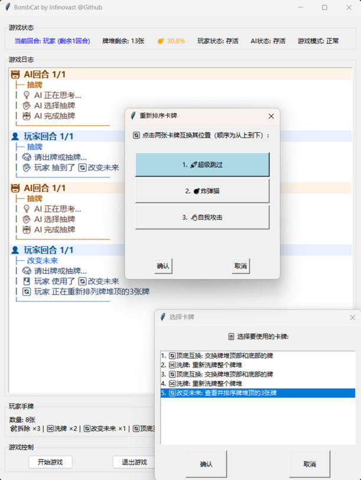

# BombCat

<p align="center">
  
</p>

BombCat 是一个基于 tkinter 的 1v1 炸弹猫对战小游戏：你与 AI 轮流行动，目标是在不断抽牌的过程中活到最后。



## 简明规则

1. 开局双方各 6 张手牌（包含 1 张拆除卡），手牌上限 9 张。
2. 你的回合内可以先出任意张功能牌；一旦执行抽牌，本回合结束。
3. 抽到炸弹猫时，若有拆除卡会消耗并把炸弹放回牌堆；没有拆除卡则立即出局。
4. 攻击、跳过、超级跳过等卡会影响当前剩余回合数，改变行动节奏。
5. 任意一方死亡后游戏结束，存活方获胜。

主要卡牌效果：

- 拒绝：让对手下一张出牌失效。
- 攻击 / 自我攻击：增加并转移（或保留）连续行动回合。
- 跳过 / 超级跳过：跳过当前回合抽牌，或直接跳过剩余全部回合。
- 预见未来 / 改变未来：查看或操控牌堆顶部顺序。
- 抽底 / 顶底互换 / 洗牌：改变抽牌位置或牌序。

## 快速开始

### 环境要求

Python 3.9+

### 运行

在项目根目录执行：

```bash
python BombCatGUI.py
```

### 基本操作

- 开始游戏：左键点击“开始游戏”。
- 出牌：点击“出牌”并在弹窗中选择卡牌（支持双击确认）。
- 抽牌：点击“抽牌”结束当前行动阶段。
- Debug 模式：右键“退出游戏”切换（可查看更多 AI 信息）。
- 快速重开：Debug 模式下右键“开始游戏”。

## 主要技术

- Python + tkinter：实现主界面、弹窗交互、日志区、按钮控制。
- 事件驱动架构：通过 tkinter 的 after 调度 AI 回合与日志队列刷新。
- 面向对象建模：Card/Player/Deck/Game/GUI 分层，卡牌效果通过子类重写 use 扩展。
- 状态同步机制：维护牌堆、弃牌堆、回合计数、Nope 状态与 AI 对牌堆认知（ai_known）。
- AI 决策：Python 规则系统 + 概率认知建模 + 多因子打分决策 + 短视野搜索（Lookahead）。

## 项目结构

- BombCat.py：卡牌定义与效果实现。
- BombCatGUI.py：GUI、回合推进、AI 行为与游戏主流程。
- Pic/：界面与项目展示图片。

## 说明

1. 这是一个单机对战版本，适合体验炸弹猫核心机制。
2. 如需扩展新卡牌，可直接在 Card 子类体系中新增类型并在牌堆初始化中注册数量。
